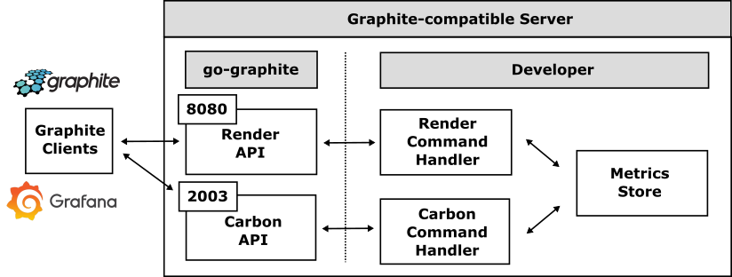

# go-graphite

The `go-graphite` handles [the Render](https://graphite.readthedocs.io/en/latest/render_api.html) and [Carbon (feeding)](http://graphite.readthedocs.io/en/latest/feeding-carbon.html) APIs of [Graphite](https://graphiteapp.org/) so that all developers can develop [Graphite](https://graphiteapp.org/)-compatible servers easily.

The `go-graphite` go-graphite can collect monitoring data from any products that support the [Graphite](https://graphiteapp.org/) interface ([the Carbon API](http://graphite.readthedocs.io/en/latest/feeding-carbon.html)), and allowing the use of useful visualisation tools such as [Graphana](https://grafana.com/) through [the Render API](https://graphite.readthedocs.io/en/latest/render_api.html).

## Table of Contents

- [Getting Started](doc/server_impl.md)

## References

- [The Render URL API](https://graphite.readthedocs.io/en/latest/render_api.html)
- [Feeding In Your Data](http://graphite.readthedocs.io/en/latest/feeding-carbon.html)
